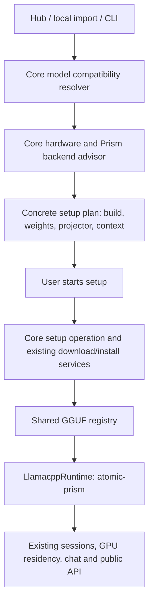

# PrismML llama.cpp and Bonsai: desktop implementation plan

Date: 2026-10-05  
Status: Development handoff; implementation and hardware acceptance have not started.  
Repositories: `atomic-chat-core`, `Atomic-Chat`; release/catalog changes in `atomic-chat-conf`.  
Related decision: [Use PrismML llama.cpp for desktop Bonsai](decisions/2026-10-05-use-prismml-llamacpp-for-desktop-bonsai.md).

Reading guide: product scope and model policy are in sections 1–3; architecture, contracts, and behavior in sections 4–9; implementation ownership and task checklists in sections 10–11; acceptance and release gates in sections 12–14. Start development with P0.1–P0.2 and the phase-1 contract work; do not treat proposed endpoints or paths as existing APIs.

## 1. Outcome and scope

A user finds a Bonsai model in the Hub, selects it, and can install the required PrismML engine and the compatible model files through one guided flow. Atomic Core chooses the engine build and model packing for the user's actual hardware. The installed model then works in the normal chat UI and through the existing public API.

The agreed engine is **PrismML's llama.cpp fork on every supported desktop OS**, including **Metal on Apple Silicon**. This work does not add a Bonsai MLX runtime. Intel Macs use a validated CPU build. There is no Docker, WSL, Python environment, source compilation, or vendor demo installer in the end-user installation flow.

### In scope

- A separate local provider, `atomic-prism`, displayed as **PrismML** or **PrismML llama.cpp**.
- Provider-isolated engine packs, settings, release selection, updates, and diagnostics.
- Reuse of the existing llama.cpp process lifecycle, shared GGUF model storage, download infrastructure, hardware service, and GPU residency control.
- Model/file compatibility detection before download where possible and before every load.
- GGUF support for Bonsai 2 27B and the first-generation ternary family, with the default policy in section 3.
- Model-specific onboarding in Hub search, model details, downloaded models, and local import recovery.
- Text chat, streaming, cancellation, reasoning, and supported tool calls; vision for validated 27B checkpoints with the matching projector.
- CLI/library/control-API parity for compatibility, installation, and loading.
- Safe recovery across app detachment, SSE reconnect, core restart, cancellation, and interrupted transfers.

### Out of scope

- Replacing the global default engine for ordinary GGUF models.
- Adding Prism changes to the Atomic TurboQuant fork, or sharing their native libraries.
- A new MLX engine, mobile support, training, conversion, or arbitrary self-quantization to Prism formats.
- DSpark, MTP, DFlash, or other speculative features in the initial release.
- Claiming better performance than Atomic TurboQuant without a controlled comparison.
- A general rewrite of model discovery, provider registration, or all engine onboarding flows.

The supported product matrix is the subset of published builds that passes section 12. Availability of a vendor archive alone does not make a device supported.

## 2. Research baseline and evidence limits

Research examined official model inventories, vendor documentation, the release source, and both local repositories. No live inference benchmark was performed during planning.

| Finding | Evidence and consequence |
| --- | --- |
| Latest release observed: `prism-b10754-2459f68`, published 2026-10-02 | [Release](https://github.com/PrismML-Eng/llama.cpp/releases/tag/prism-b10754-2459f68). This is an acceptance candidate, not an automatically approved production pin. |
| Demo documentation links an older release, `prism-b10743-adfffbe` | [Demo](https://github.com/PrismML-Eng/Bonsai-demo). Record the exact release actually tested rather than equating demo, branch head, and latest release. |
| Bonsai 2 GGUF requires Prism-specific runtime behavior, including Hadamard/sign transforms | [Backend support](https://github.com/PrismML-Eng/Bonsai-demo/blob/main/BACKEND-SUPPORT.md). A successful load on stock llama.cpp does not establish correct output. |
| Older binary Q1_0 and official group-64 Q2_0 have upstream support | [Bonsai 1](https://github.com/PrismML-Eng/Bonsai-demo/blob/main/Bonsai1_README.md). Validate the shipped upstream version; do not require Prism for every Bonsai file. |
| Legacy group-128 Q2_0 reused the official type id | [Formats](https://github.com/PrismML-Eng/Bonsai-demo/blob/main/MODEL-FORMATS.md). Filename/type id alone cannot resolve every old file. |
| Compatibility documentation lags some Vulkan changes | The old matrix audits `prism-b10709-9a9394a`; the [candidate release Vulkan source](https://github.com/PrismML-Eng/llama.cpp/blob/prism-b10754-2459f68/ggml/src/ggml-vulkan/ggml-vulkan.cpp) includes PQ2_0 and PTQ1_0 paths. Do not encode a permanent PQ2_0/Vulkan ban from that table. |
| Bonsai 2 has no official DSpark drafter in the current demo | [Speculative decoding](https://github.com/PrismML-Eng/Bonsai-demo/blob/main/SPECULATIVE.md). Keep speculative decoding disabled in this integration. |

Published model quality and speed results are vendor measurements. Use them to choose experiments, not as Atomic product claims. Known-issues pages include stale statuses; inspect each issue against the chosen release before making a build exclusion.

## 3. Initial model catalog and default routing

### 3.1 Prism-default catalog

Sizes below are approximate decimal GB for language-model files, not total memory requirements. The revision and SHA-256 of each production file must be pinned during phase 0. Do not download an entire repository.

| Hugging Face repository | File(s) | Approximate GB | Default treatment |
| --- | --- | ---: | --- |
| `prism-ml/Ternary-Bonsai-2-27B-gguf` | `Ternary-Bonsai-2-27B-PQ2_0.gguf` | 7.206 | Featured Bonsai model; `atomic-prism` required. |
| Same repository | `Ternary-Bonsai-2-27B-PTQ1_0.gguf` | 5.947 | Alternative packing of the same model; `atomic-prism` required. |
| `prism-ml/Ternary-Bonsai-27B-gguf` | `Ternary-Bonsai-27B-PQ2_0.gguf` | 7.165 | Previous generation; `atomic-prism` required for this packing. |
| `prism-ml/Ternary-Bonsai-8B-gguf` | `Ternary-Bonsai-8B-PQ2_0.gguf` | 2.182 | Smaller model; `atomic-prism` required for this packing. |
| `prism-ml/Ternary-Bonsai-4B-gguf` | `Ternary-Bonsai-4B-PQ2_0.gguf` | 1.075 | Smaller model; `atomic-prism` required for this packing. |
| `prism-ml/Ternary-Bonsai-1.7B-gguf` | `Ternary-Bonsai-1.7B-PQ2_0.gguf` | 0.463 | Smallest model; `atomic-prism` required for this packing. |

Official inventories: [Bonsai 2](https://huggingface.co/prism-ml/Ternary-Bonsai-2-27B-gguf/tree/main), [ternary 27B](https://huggingface.co/prism-ml/Ternary-Bonsai-27B-gguf/tree/main), [8B](https://huggingface.co/prism-ml/Ternary-Bonsai-8B-gguf/tree/main), [4B](https://huggingface.co/prism-ml/Ternary-Bonsai-4B-gguf/tree/main), [1.7B](https://huggingface.co/prism-ml/Ternary-Bonsai-1.7B-gguf/tree/main).

For the research snapshot, the Bonsai 2 repository revision was `b072e1d3b35a0a630cece372c2127528e0994386`. Treat it as a traceable research input; phase 0 chooses and validates the production revision.

The two Bonsai 2 packings belong to one model card with a variant selector. The app must not present them as different model generations. Default to the compatible packing recommended by the core. Selecting another packing changes the file download; it must not silently replace an already installed file.

For vision, use the matching `*-mmproj-Q8_0.gguf` from that model's repository (approximately 0.629 GB for the researched 27B files). The setup summary exposes an image-support option, includes its cost, and records the selection. Text-only installation skips the projector. Never substitute a projector from another generation merely because sizes match.

### 3.2 Existing and special-case files

| File family | Required behavior |
| --- | --- |
| `Bonsai-1.7B`, `Bonsai-4B`, `Bonsai-8B`, `Bonsai-27B`, Q1_0 GGUF | Keep existing/default compatible upstream routing after checking the shipped build. Prism is an optional validated alternative, not a mandatory installation. |
| First-generation ternary official group-64 | `*-Q2_0_g64.gguf`, with `Ternary-Bonsai-27B-Q2_g64.gguf` as the 27B spelling: allow validated upstream or Prism. Preserve existing user choices. |
| First-generation legacy `*-Q2_0.gguf` | Detect known legacy artifacts, explain the incompatible layout, and offer a current file. Do not install frozen prism-v5 automatically. |
| Bonsai 2 development Q2_0 | Requires Prism despite the official quant type. Support recognition/import diagnostics; exclude the development repository from default recommendations. |
| Bonsai 2 F16 | Do not infer upstream compatibility from F16. Retains model-specific transform requirements. Exclude from normal download defaults. |
| MLX, unpacked checkpoints, AWQ | Outside the Prism GGUF provider. Do not reroute these to `atomic-prism` based on the model name. Existing MLX behavior is unchanged. |
| Draft models and projectors | Never offer as standalone chat-model download variants. |
| Third-party repacks or ambiguous type-42 files | Inspect evidence; report unresolved compatibility when necessary. Do not infer safety or reject an unrelated ordinary GGUF from a brand-name substring. |

## 4. Architecture and ownership



### 4.1 Core responsibilities

- Compatibility and default provider selection are core policy, shared by UI, CLI, and library callers.
- Hardware comes only from `HardwareService`; the frontend does not select a build from browser UA, OS labels, or its own GPU probe.
- `BackendAdvisor` gains a provider-specific Prism policy and catalog adapter. Reuse interfaces, not TurboQuant's thresholds or upstream's release matrix.
- Instantiate `LlamacppRuntime` for `atomic-prism`. Shared spawn, readiness, cancellation, process journal, ports, and idle unload remain authoritative.
- Check model/runtime compatibility before acquiring the resident GPU or evicting another model. Installation alone does not evict an active session.
- Include Prism in the normal GPU claim policy across text engines and diffusion. No special independent session registry.
- Keep the permanent loopback control listener and independently managed public inference listener unchanged.

### 4.2 App responsibilities

- Display model requirements and the core's recommendation; preserve the user's selected file and starting UI location.
- Render setup, progress, recovery, compatible advanced overrides, and engine settings.
- Register a thin desktop provider adapter using `extensions/shared/atomicCoreRuntime.ts` and the existing core relay. Package it with the app's extension/bundle machinery.
- Keep all engine downloading and process ownership in the core. Do not add a parallel Rust Prism runtime.
- Reuse the image setup presentation pattern; do not attach text inference to `DiffusionService` or image-generation state.

### 4.3 Runtime identity and storage

The plan reserves provider id `atomic-prism`; display name is independent of this stable wire identifier. Existing provider ids remain unchanged.

Planned paths, to add to `DataLayout`, `docs/contracts.md`, and the app's matching path contracts in phase 1:

| Path | Purpose |
| --- | --- |
| `<data>/atomic-prism/backends/<release>/<backend>/build/bin/` | Complete normalized engine pack, including its matching native libraries. |
| `<data>/atomic-prism/tmp/` | Archive staging and resumable transfer state. |
| `<data>/llamacpp/models/<id>/` | Existing shared GGUF/model.yml tree; no new Prism weights tree. |
| `<data>/atomic-core/prism-setups/<operation_id>.json` | Versioned setup operation records, containing identifiers/status but no credentials. |
| Existing `settings.json` and `optimal-backend.json` | New provider scope/record; no independent settings store. |

These are planned additions, not already supported paths. The implementation must document them before writing them. Do not reuse TurboQuant's `lib` directory. Bundle Windows runtime DLLs into the corresponding Prism pack. Removing the engine keeps shared model weights. Removing a shared model follows existing ownership/reference rules and unloads relevant sessions first.

Use additive, versioned model metadata for requirements and source identity, e.g. an optional `atomic_runtime` object in `model.yml`. It records catalog rule version, source repository/revision/file, preferred provider, and required capabilities. It is a cache/provenance record, not proof of compatibility after a file changes. Preserve unknown fields and current model ids, paths, and hashes. Old files without this field are inspected lazily.

## 5. Compatibility resolver

Separate pure decision code from local/range reads and HTTP. Suggested location: `src/models/compatibility/`, public exports through `src/models/index.ts`. Keep Prism release policy in `src/backend/`; do not create an unrelated generic engine framework.

### Inputs

- Source kind: catalog file, Hugging Face URL, local registered model, or local import.
- Exact repository, revision, filenames/shards, declared checksums, and selected projector.
- Observed GGUF metadata and tensor descriptors/types; architecture and Prism transform evidence.
- Installed/approved engine capabilities keyed by provider, release, backend, and model family.
- Hardware facts, available memory, requested context, and any explicit user provider choice.

### Evidence and resolution order

1. Resolve a curated record by exact artifact identity. Repository/filename can give a provisional pre-download recommendation; checksum/revision establishes identity after transfer.
2. Inspect GGUF evidence. In the candidate release, tensor types Q1_0=41, official Q2_0=42, Prism PQ2_0=142, and PTQ1_0=143. These are tensor-type ids, not automatically `general.file_type` values. Pin their interpretation to source/fixtures.
3. Inspect `prism.hadamard.*` and other required transform/layout metadata using exact keys verified in phase 0. Bonsai 2's requirement applies even to a standard quantization or F16.
4. Detect known legacy files and contradictory/corrupt evidence. Do not resolve reused type 42 solely from its numeric value. If layout cannot be proved, ask for a current supported file rather than trial-loading a likely incompatible one.
5. Produce compatible providers/build constraints and a preferred provider. Filter compatibility first, then rank choices. Explicit incompatible choices return a useful error; they must never silently execute on another engine.
6. Recheck against the selected runtime and unchanged file identity before spawn. No fallback from a Prism-required model to upstream/TurboQuant on an install or launch failure.

The current `src/models/gguf/reader.ts` reads metadata only, not the tensor table. Add a bounded tensor-descriptor inspector; do not pretend that the current metadata reader identifies private tensor types. Preserve the existing reader's contract. Test count/offset/length overflow, truncation, sharding, unknown types, and files whose metadata is larger than the first read. Do not read whole multi-GB tensors to classify a file.

When remote range requests are supported, use bounded metadata inspection. When unavailable, fall back to catalog evidence or return `inspection_required`; never turn a preflight into an unannounced full model download. An ambiguous Prism candidate stays visible in search with an actionable explanation. Ordinary unrelated models retain existing routing.

### Routing invariants

- Existing cloud precedence and unrelated local-provider tie-breaking remain unchanged.
- App and public API model-only resolution use the same compatibility result. Do not fix this only in the Hub button.
- Preserve an existing valid session/provider preference for compatible files.
- Deduplicate shared GGUF models by existing model/file identity, not by provider registration count.
- An explicit legacy upstream selection for a newly recognized Prism-required file produces recovery guidance; automatic resolution chooses Prism.
- Apply the same checks to CLI load, public API auto-load where supported, library calls, imported files, model rename, and restart recovery.

## 6. Release catalog and hardware selection

### 6.1 Catalog publication

Use an Atomic-controlled, schema-validated manifest plus a bundled baseline, following the current backend catalog pattern. Planned configuration files are `backends/atomic-prism-manifest.json` and `backends/atomic-prism-schema.json` in `atomic-chat-conf`. They require the conf repository's normal review/publish workflow; do not create an independent service.

Every approved artifact entry includes:

- Provider, immutable release tag and source commit, platform/arch/backend id.
- Exact asset URL/name, archive size, SHA-256, normalized executable/layout, and required companion assets with their own hashes.
- Required OS/ABI/CPU features, GPU family/architecture and driver/runtime constraints where relevant.
- Supported tensor formats, model transforms, serving features, and tested model revisions.
- Minimum app/core versions, validation status, and known device exclusions/fallbacks.

Production selection consumes approved entries, never a moving GitHub `/latest` URL. Discovery may inspect newer releases for maintainers; it cannot mark them approved. Reuse established mirror/signature conventions where applicable. Prefer a verified mirror or the exact pinned official artifact; neither may bypass the hash requirement. Preserve a last-known-good installation when the remote catalog is unavailable.

### 6.2 Candidate selection matrix

| Host | Candidate order to validate | Initial policy |
| --- | --- | --- |
| macOS arm64 | Metal; CPU fallback | Main Mac path. Standard arm64 pack first; KleidiAI only if a measured benefit justifies it. No MLX dependency. |
| macOS x64 | CPU | Expose only after OS/CPU baseline and performance smoke pass. |
| Windows x64 NVIDIA | Compatible validated CUDA; Vulkan; CPU | Choose by GPU architecture, driver, and tested build. Include required CUDA DLLs in download size. |
| Linux x64 NVIDIA | Compatible validated CUDA; Vulkan; CPU | Validate actual GLIBC/runtime dependencies and GPU architecture. |
| Windows/Linux x64 AMD | Validated HIP/ROCm or Vulkan; CPU | Device-specific order and exclusions; no universal HIP preference. |
| Windows/Linux x64 Intel GPU | Validated Vulkan; CPU | Test real offload and a long generation, not just device enumeration. |
| CPU-only Windows/Linux x64 | CPU | Check ISA support; classify expected latency separately from fit. |
| Windows/Linux arm64 | Published builds evaluated separately | Deferred by default; not required for the first desktop release. No inference from x64 evidence. |

The choice is a tuple: **release + backend + model packing + context + projector placement**. A globally optimal backend record alone is insufficient for all models. Keep the existing engine recommendation API and add model-aware planning around it. Cache model-aware results by hardware/driver fingerprint, release/catalog revision, artifact identity, context, and vision selection.

### 6.3 Packing and memory policy

- Start Metal and validated CUDA testing with Bonsai 2 PQ2_0; compare PTQ1_0 for tighter memory and device-specific throughput. Keep the choice explainable as “faster prompt processing” or “smaller download/memory footprint” only where measured.
- Validate both packings on the chosen Vulkan release. Do not inherit the outdated no-PQ2_0 rule.
- Account for language weights, projector placement, KV cache, hybrid/recurrent state, runtime buffers, and OS/app headroom. A file fitting into VRAM does not prove inference will fit.
- Treat Apple/unified memory as one pool; do not add GPU memory to RAM. Do not sum multiple GPUs unless the selected multi-GPU policy is validated.
- Start with conservative context tiers (8K, 16K, 32K as candidates), chosen from measured fit. The advertised 262K maximum is not a default.
- If GPU-only fit fails, offer a validated reduced-context or CPU/partial-offload option with a clear explanation. Never silently download another several-GB packing or switch model generation.
- If facts are missing, return uncertainty with a usable next action. Hardware detection failure is not proof that CPU is optimal.

## 7. Installation, update, and recovery

Use one small core-owned setup operation for the selected Prism model, composed from existing backend install and model download/import services. Do not introduce a general workflow engine.

Suggested state machine:

`queued -> installing_engine -> downloading_model -> downloading_projector (optional) -> verifying -> registering -> ready`

Any active stage can end in `failed` or `cancelled`; core restart can produce `interrupted`. Already satisfied stages are skipped. “Ready” means verified artifacts and registration are complete, not that a model is resident in VRAM. Normal chat loading uses the existing session lifecycle.

### Required semantics

- Read-only planning never starts downloads. Only the user's install action creates the operation.
- Pin the exact plan/artifacts at operation creation. If the manifest or hardware changed incompatibly, return a stale-plan outcome and show a refreshed summary before downloading changed artifacts.
- Use client request ids for idempotency. Double-clicks, response loss, and multiple app windows must not duplicate installations. Shared engine transfers have explicit ownership: cancelling one setup must not cancel a transfer another setup still needs.
- The existing resumable `.tmp`/`.url`, checksum, proxy, disk-error tags, safe archive extraction, and cancellation mechanisms remain in use.
- Include staging, extraction, companion DLLs, model/projector files, and existing resumable bytes in disk planning. Recheck disk space at stage boundaries.
- Verify archive hashes and pack completeness before atomic publication. Validate executable architecture/startup, dynamic-library resolution, and expected engine identity/help capabilities without claiming this proves model quality. Preserve required license and attribution notices when mirroring or repackaging vendor assets.
- A successful engine stage survives a later model-download failure. Retry resumes missing stages, not the whole flow. Completed verified model files are not deleted on cancellation.
- Persist operation identity, selected immutable plan, child task ids, progress/stage, and error details. Never persist proxy passwords, HF tokens, prompts, or arbitrary request headers in these records.
- App exit/navigation only detaches. Core restart reconciles disk and task state and exposes `interrupted` with explicit Resume; it does not claim a dead transfer is still active. Resume uses the original pinned artifacts and requests credentials again when necessary.
- All paths are resolved through `DataLayout`; a supported data-folder move handles setup records and artifacts consistently. Resume must reject stale source paths and re-evaluate disk/hardware facts.
- SSE carries progress; snapshot/list operations are the source of truth after missed events or a new core instance. Never regress a finished stage on replayed progress.

### Updates and removal

- Install updates alongside the working release. Do not replace files underneath a running process.
- Validate the new pack and currently installed model requirements before activating it. Keep the previous working release available for rollback.
- A failed update leaves the prior selection intact. A withdrawn catalog entry disables new automatic recommendations; do not delete installed weights or rewrite a running session.
- Engine removal is explicit, refuses/remediates active use through the normal unload flow, and never removes shared GGUF files.
- Resetting engine settings changes only `atomic-prism`. TurboQuant cache options and decision-engine settings are not copied into Prism.

## 8. Proposed contracts and application flow

The names below are proposed new contracts, not existing endpoints. Finalize them together with app fixtures in phase 1; changing the naming must preserve the behavior in this section.

### 8.1 Contract surface

Keep existing `/atomic/v1/backends/:provider/{catalog,recommendation,updates,install}` and model/session routes, extending accepted providers with `atomic-prism`.

| New surface | Behavior |
| --- | --- |
| `POST /atomic/v1/models/compatibility` | Read-only resolution for a selected catalog artifact or an allowed local model/import source. Returns status, required capabilities, compatible/preferred providers, evidence, and reason codes. |
| `POST /atomic/v1/models/setup-plan` | Read-only concrete recommendation with plan id/digest, catalog revision, model files, engine assets, bytes still needed, fit/context estimate, warnings, and blockers. |
| `POST /atomic/v1/model-setups` | Starts an idempotent operation from an unchanged plan, with transient network credentials supplied through existing request policy. Returns operation id and snapshot promptly. |
| `GET /atomic/v1/model-setups` and `GET /atomic/v1/model-setups/:id` | Recover active/recent operations and their stages after reconnect/restart. Include sufficient current state in the normal snapshot or an explicitly referenced snapshot extension. |
| `POST /atomic/v1/model-setups/:id/cancel` and `/resume` | Explicit cancellation or resume of the pinned operation. Reject unsupported transitions with stable errors. |
| `model-setup:changed` | Versioned operation snapshot/stage event, declared in `src/contracts/events.ts` and mapped by the app relay in the paired change. Reuse current download events for transfer detail. |

The first setup implementation accepts `atomic-prism` only; requests for other providers receive an explicit unsupported-operation response. Generic endpoint spelling does not expand this project into migrating other engine installers.

Browser-safe types belong in `src/contracts/`; client methods in `src/client/control-client.ts`. App transport continues through the Rust relay. Validate source unions and reuse current local-path/network access rules; these routes are not arbitrary file-read or URL-fetch endpoints.

Suggested compatibility outcomes: `compatible`, `engine_required`, `engine_update_required`, `legacy_artifact`, `inspection_required`, `unsupported`. Separate host support and memory-fit information from format compatibility.

Reuse existing `AtomicCoreError` codes where they express the outcome. Proposed additions for gaps: `MODEL_ENGINE_INCOMPATIBLE`, `MODEL_FORMAT_LEGACY`, and `MODEL_SETUP_PLAN_STALE`, with actionable details and mirrored app mappings. Document HTTP status mappings and fixtures before implementation. Preserve `[disk_*]` tags and established cancellation codes.

### 8.2 UI behavior

| Entry/state | User-visible behavior |
| --- | --- |
| Search result | Model remains discoverable before engine installation. Show “Requires PrismML” only for an identified required artifact; never download on search. |
| Model details | One selected packing, core recommendation, estimated download/fit, vision option, and a concise reason. Advanced options show compatible choices only. |
| Engine absent or too old | “Set up Bonsai” sheet: selected model, recommended device/backend, engine/model/projector sizes, and “Install and download”. No manual visit to engine settings is required. |
| Engine ready, weights absent | Normal download action with the selected compatible provider already resolved. |
| Weights present, engine absent | Install only the engine; reuse the file. Local import gets the same recovery flow. |
| Download in progress | Separate engine/model/projector progress under the selected model; navigation is safe; cancel/retry available where valid. |
| Ready | “New chat” uses `atomic-prism` and the selected file. Do not change the user's global default model/provider. |
| Unsupported/ambiguous file or host | Explain the actual cause and offer compatible file, validated fallback, or rescan. Keep unrelated model actions working. |
| Older attached core | Feature is unavailable with “Update Atomic Core”; do not fall back to upstream for a Prism-required file. |

Use `ImageSetupCard.tsx` and `useImageEngine.ts` as UX references. Add a focused text-model setup store/hook rather than importing image-generation state. Keep locale strings in existing locale files, keyboard/focus behavior accessible, and the primary action visible at small window sizes. Use the app's UI layout and real-browser verification rules.

### 8.3 Mixed versions and rollout compatibility

Do not assume an additive TypeScript union is harmless on the wire. Audit Rust enums/deserializers, extension bundles, snapshot mirrors, local-provider filters, and existing app/core attachment checks.

Expose supported providers/setup capability in the negotiated core status. New app + old core disables Prism setup cleanly. Prove old app + new core can deserialize the resulting snapshot/events; if it cannot, bump the control protocol and refuse attachment explicitly. Never silently drop Prism sessions. Record the result in contract fixtures and the implementation ADR update/successor.

An older binary may ignore new `model.yml` fields, so metadata alone cannot make arbitrary downgrades safe. For rollback, retain a compatibility-aware core/app pair; document that unrelated old releases cannot be guaranteed to protect Prism-only files. Do not solve downgrade safety by duplicating or relocating all shared weights.

## 9. Serving behavior and model defaults

- Use the existing public `/v1` surface and normal local session APIs. Keep authentication, streaming, cancellation, idle unload, and public-listener start/stop semantics unchanged.
- Derive flags from tested Prism release capabilities. Parse Prism tags explicitly; do not accidentally use an upstream build-number heuristic or TurboQuant version regex.
- Reject or hide unsupported flags, TurboQuant-only cache formats, speculative toggles, and unvalidated multi-GPU modes for this provider. Keep a tested conservative KV-cache default.
- Publish model capabilities per checkpoint and complete installed components. Projector presence alone is not a proof of image compatibility; vision requires a matched tested pair.
- Validate reasoning output separation, token usage accounting, finish reasons, and tool-call round trips through Atomic's API adapters, not only by calling llama-server directly.
- Bonsai 2's published thinking sampling baseline is temperature 1.0, top_p 0.95, top_k 20, min_p 0.05. Validate before shipping presets. Prefer `medium` reasoning for the app's initial interactive preset if acceptance confirms it; keep `xhigh` selectable where valid.
- Known reports include HTTP errors for `reasoning_effort: high` and truncated/empty answers under short output budgets. Define supported UI levels and API validation/mapping explicitly; do not silently reinterpret a caller's standard field. Coordinate output budget with available context and measured memory.
- Keep model-specific defaults separate from provider-global settings and preserve explicit user overrides that remain valid.
- Do not silently rewrite arbitrary system/tool messages to work around a vendor template. Test existing message normalization, identify unsupported cases, and return actionable errors or make a separately tested documented adapter change.
- No automatic warm-up inference on installation completion. Live correctness tests belong to release acceptance; a user starts actual model loading through the normal flow.

Vendor serving caveats: [known issues](https://huggingface.co/prism-ml/Ternary-Bonsai-2-27B-gguf/blob/main/KNOWN_ISSUES.md). Revalidate against the chosen runtime/model revisions instead of copying stale status labels.

## 10. Implementation map

Paths refer to existing files/directories unless marked new. App paths are relative to `Atomic-Chat`; conf paths to `atomic-chat-conf`.

| Area | Core touchpoints | App/config touchpoints |
| --- | --- | --- |
| Provider identity and settings | `src/contracts/session.ts`, `backend-advisor.ts`, `settings.ts`; `src/settings/schema.ts`, new `schema/atomic-prism.json`; local provider filters in core/cloud/CLI | Local engine registration and settings; thin adapter using `extensions/shared/atomicCoreRuntime.ts`; extension packaging and core version pin |
| Paths and shared registry | `src/config/paths.ts`; `src/models/{registry,model-yml}.ts`; `src/contracts/model-yml.ts` | Existing model.yml readers/writers, import/download registration, shared-model removal |
| GGUF requirements | New `src/models/compatibility/`; `src/models/gguf/{reader,read-file,classify}.ts`; `src/models/index.ts` | `web-app/src/lib/model-card.ts`, `containers/hub/DownloadOptionsSelect.tsx`, model catalog types and file filtering |
| Catalog, install, recommendations | `src/backend/{catalog,select,installed,install,optimal,advisor}/`; new Prism policy/adapter | New conf backend manifest/schema; engine settings consume core recommendation |
| Runtime and routing | `src/runtime/llamacpp/{runtime,args,load-plan,errors}.ts`; `src/core/{create,sessions,gpu-residency}.ts`; `src/router/resolve.ts` | `containers/ModelDownloadAction.tsx`, `lib/hub-installed.ts`, chat load and model-selection actions |
| Setup operation and API | New `src/core/model-setup/` with `index.ts`; contracts, client, and `src/server/control/routes/` | New focused setup UI/store; downloads panel; `src-tauri/src/core/atomic_core/relay.rs` and session/snapshot mirrors |
| Curated models | Embedded validated requirements baseline, compiled-safe JSON import | `models/staff-picks.json` and relevant schemas in conf; `web-app/src/constants/staff-picks.ts` fallback; HF search remains available |
| Tests/docs | Unit + fixtures + contract/e2e/app-e2e/live; contracts and critical-flow grades | Adapter/bundle tests, UI flow tests, Rust relay fixtures, browser checks, paired ADR |

Do not use the cloud-provider registry to register a local engine. No new runtime dependency is required by this design. Any dependency proposed later follows the repository's explicit approval/ADR rule.

## 11. Delivery phases and work packages

Each checkbox is an implementation deliverable, not a claim that work is complete. Phase gates make changes reviewable; they do not require inventing additional user approval prompts for ordinary development.

### Phase 0 — Pin evidence and validate the viable baseline

- [ ] P0.1 Inventory candidate release assets and dependency/CPU/GPU constraints; record exact tags, source commits, sizes, and hashes.
- [ ] P0.2 Pin all five Prism-default model families and projector pairs; inspect real headers/tensor descriptors. Create small lawful fixtures with provenance and expected classification, including legacy type-42 and renamed files.
- [ ] P0.3 Run direct-engine correctness/serving/memory smoke on Apple Silicon Metal, Windows NVIDIA CUDA, and Linux NVIDIA CUDA. Include CPU and AMD/Intel candidates according to available hardware.
- [ ] P0.4 Record build-specific exclusions, packing/context recommendations, and vendor issue status. Compare latest against the demo pin if either regresses.
- [ ] P0.5 Write the acceptance evidence table with hardware, driver, commands, artifacts, pass/fail, and measured timings. Choose the first approved release and rollout matrix.

Exit: at least one viable Mac, Windows, and Linux path is demonstrated, and unsupported combinations are explicit. Unavailable hardware remains unvalidated; fake-process tests cannot fill this gap. Do not hold all useful coding work for every optional GPU family, but do not publish unvalidated families as supported.

### Phase 1 — Contracts, identity, and compatibility

- [ ] P1.1 Add `atomic-prism` through contract types, settings scopes, CLI/provider validators, local/cloud filters, and data layout without changing existing defaults.
- [ ] P1.2 Implement bounded GGUF inspection and pure requirement resolution with exact artifact/rule provenance and lazy reinspection after file changes.
- [ ] P1.3 Define setup/compatibility API schemas, errors, snapshot/event payloads, and optional model.yml fields; add paired app fixtures and relay mappings.
- [ ] P1.4 Specify mixed-version attachment behavior; update `docs/contracts.md`, the app ADR, and protocol/version gates if needed.

Exit: fixtures prove every row in section 3 routes or fails as intended; ordinary GGUF and existing wire contracts remain compatible.

### Phase 2 — Backend catalog and installation

- [ ] P2.1 Add Prism manifest/schema/bundled baseline and pure provider selection policy based on phase-0 evidence.
- [ ] P2.2 Normalize official archive layouts, verify checksums, install companion libraries, and validate executable identity/startup on supported OSes.
- [ ] P2.3 Extend backend advisor/install/update/remove APIs and provider-specific optimal caching; prove existing provider selections are unchanged.
- [ ] P2.4 Implement side-by-side updates, rollback, disk planning, cancellation, proxy behavior, and missing/offline catalog handling.

Exit: compiled core can install the exact approved pack and recover from a failed update without damaging the active installation.

### Phase 3 — Runtime and provider-aware routing

- [ ] P3.1 Wire Prism into `LlamacppRuntime`, sessions, settings, process journal/reaping, cancellation, and GPU residency.
- [ ] P3.2 Enforce compatibility before spawn/eviction in every load entry point. Filter shared-registry candidates before existing route precedence.
- [ ] P3.3 Gate flags by tested release capabilities and apply model-specific sampling/reasoning/vision defaults.
- [ ] P3.4 Prove text streaming, tool calls, images, cancellation, and supported public API adapters through the compiled core.

Exit: a Prism-required file cannot accidentally run on upstream/TurboQuant, and supported models use normal Atomic session behavior.

### Phase 4 — Recoverable setup orchestration

- [ ] P4.1 Implement read-only setup planning and a core-owned idempotent operation using current transfer services.
- [ ] P4.2 Implement state persistence, snapshot/SSE updates, shared-transfer ownership, cancel, retry, restart reconciliation, and explicit resume.
- [ ] P4.3 Add CLI/library/client access to the same planner/operations; headless requests return actionable setup requirements rather than starting hidden downloads.

Exit: disconnecting the app does not lose work; restarting the core exposes truthful recoverable state; retry does not duplicate verified artifacts.

### Phase 5 — App integration and onboarding

- [ ] P5.1 Register/package the thin provider adapter and gate feature availability by attached core capability.
- [ ] P5.2 Make Hub search/details, download quant selection, installed-model deduplication, local import, and chat actions use core compatibility/planning.
- [ ] P5.3 Implement the setup sheet, per-stage progress, vision option, advanced compatible choices, cancel/retry/resume, and unsupported states.
- [ ] P5.4 Add engine settings/update/remove surfaces, model capability badges, locales, accessibility, and small-window layout checks.
- [ ] P5.5 Verify ordinary models and image-generation onboarding have no behavior regressions.

Exit: all entry points reach a usable chat without manual provider repair; the app never independently guesses the backend.

### Phase 6 — Acceptance, packaging, and rollout

- [ ] P6.1 Complete the scenario matrix in section 12, including Windows runtime CI and live evidence for each enabled build/device family.
- [ ] P6.2 Publish reviewed conf entries and aligned core/app versions through normal release workflows. Check signed/notarized macOS packaging and real Windows/Linux dynamic-library behavior.
- [ ] P6.3 Start with validated Mac Metal, NVIDIA CUDA, and validated CPU routes; enable AMD/Intel variants only as their evidence passes. Keep the capability resolver able to refuse unsafe files even when new installs are disabled.
- [ ] P6.4 Record rollback steps, update critical-flow grades, and publish user-facing limitations grounded in measured behavior.

Dependencies: P0 -> P1/P2; P1+P2 -> P3; P1+P2 -> P4; P1+P4 -> P5; all required phases -> P6. UI prototypes can use contract fixtures before runtime completion. A production-ready label requires the full acceptance path.

## 12. Tests and acceptance criteria

### 12.1 Automated scenario matrix

| ID | Scenario | Required evidence |
| --- | --- | --- |
| A01 | Fresh supported host selects Bonsai 2 in Hub | Recommended build + packing shown; explicit install downloads only chosen files; New chat streams a response through Prism. Compiled-core e2e and app-e2e. |
| A02 | Engine present/model absent; model present/engine absent; both present | Only missing components installed; existing file/hash reused; no redundant onboarding. |
| A03 | First-generation Q1_0 and group-64 vs PQ2_0; Bonsai 2 standard types/F16 | Correct per-file requirements; upstream-compatible models keep existing behavior. Unit, contract, compiled e2e. |
| A04 | Legacy type-42, renamed file, ambiguous third-party file, corrupt/sharded GGUF | Reliable classification or actionable unresolved result; no wrong-engine spawn and no unbounded reads. |
| A05 | Hardware/driver/release changes or stale setup plan | Recompute choice, explain blockers, never apply old incompatible cached recommendation. |
| A06 | Duplicate clicks, two windows, simultaneous setups sharing a pack | Idempotent operations; one installation; cancelling one consumer does not strand another. |
| A07 | Cancel/retry in engine/model/projector stages, hash mismatch, extraction failure, low disk, proxy interruption | Stable errors, truthful stage state, verified prior artifacts preserved, successful resume without re-downloading completed stages. |
| A08 | App detach, SSE gap, core crash/restart during each stage | Snapshot rebuild with instance identity; interrupted operations recover; no false-ready, lost progress, or orphan worker. |
| A09 | Update fails or old/new release requirements differ | Active build remains usable; side-by-side rollback; no active native library replacement. |
| A10 | Shared GGUF registration, rename, deletion, engine removal | No duplicate Hub entries; normal ownership semantics; removing engine preserves model files and other providers. |
| A11 | Prism load while another text/diffusion model is resident | Existing GPU residency rule enforced; incompatible preflight does not evict a working model. |
| A12 | Plain chat, streaming, stop/cancel, reasoning, multi-turn tools, vision | Correct API shapes, finish reasons, usage, bounded cancellation; matched projector and semantic response checks. |
| A13 | Explicit incompatible provider and model-only public API lookup | Useful failure for explicit mismatch; compatible automatic resolution; cloud precedence preserved. |
| A14 | New app/old core; old app/new core; malformed new fields | Feature gating or explicit protocol refusal; no silently discarded session/snapshot. |
| A15 | Offline installed model; unavailable/malformed remote manifest | Chat still works with approved installed pack; no hidden downloads; cached/bundled catalog behavior is deterministic. |
| A16 | CLI and library operations; Node and compiled Bun runtime | Same compatibility/install/load result and recovery semantics as app control calls. |

Every exported policy/helper has adjacent meaningful unit tests. I/O tests use fake processes and fixture servers. Wire fixtures pin source revisions and semantic comparators with dynamic-field normalization. Do not raise critical-flow grades using line coverage or fake-engine success alone.

### 12.2 Real-engine acceptance

For each enabled OS/GPU/build combination record: OS version, CPU/ISA, GPU/VRAM or unified memory, driver/runtime version, engine tag/hash, model revision/file/hash, projector, launch arguments, context, KV settings, and concurrency.

Measure:

- Cold load, time to first token, prompt processing, decode throughput at short and nontrivial context, and peak RAM/VRAM.
- English and Russian instruction following, a simple deterministic correctness set, and absence of corrupt/repetitive output.
- Multi-turn tool calls through Atomic, including empty-argument tools and a subsequent tool result; reasoning settings and token-budget behavior.
- Vision/OCR with a matched projector; text-only operation without it.
- Long generation/prompt stability on Intel Vulkan, and known problematic AMD/HIP/CUDA combinations against the actual selected release.
- Process exit, interrupted load, prompt cancellation, idle unload, and repeated reload without leaked GPU claims/processes.

A hardware tier passes only if output is semantically correct, serving contracts hold, and stability/memory behavior matches the UI recommendation. `/health` 200, a GPU in `--list-devices`, or the presence of a shader in source is insufficient. Record performance targets from phase-0 measurements before calling a packing/build “recommended”.

### 12.3 Repository gates

Core implementation PRs:

```sh
npm run verify
npm run test:runtime-compat
```

`verify` currently includes compiled-binary e2e. For runtime changes also run/report `npm run test:e2e` on the developer's OS as required by AGENTS.md, and obtain mandatory Windows CI evidence. Run `npm run test:app-e2e` with the paired app build and the targeted live suite with `ATOMIC_LIVE=1` under the repository's documented setup.

App implementation PRs run `make verify`, extension/bundle checks, applicable browser/UI scenarios, and platform checks required by the app's AGENTS.md. Conf changes run that repository's schema/manifest validation. Update [critical-flow evidence](testing-critical-flows.md) and [app-e2e documentation](app-e2e.md); no grade or coverage-floor reductions.

### Definition of done

- [ ] All five Prism-default model families have pinned files and a validated route; unvalidated tiers are not recommended.
- [ ] Supported fresh installs work from search to chat on macOS, Windows, and Linux; Mac needs no MLX installation.
- [ ] Required-engine rules hold in the app, CLI, library, and public API; imports and renamed files do not bypass them.
- [ ] Engine/model download, update, rollback, cancellation, and restart scenarios pass.
- [ ] Existing providers, shared storage, cloud routing, GPU residency, and image onboarding retain their contracts.
- [ ] Paired schemas/events/fixtures, packaging, ADRs, user-facing limits, and live evidence are complete.
- [ ] No new runtime dependency or unsupported performance claim was introduced implicitly.

## 13. Risks and decisions to close during development

| Risk/open validation | Owner/work package | Resolution required |
| --- | --- | --- |
| Vendor docs disagree with a release's source | P0/P2, core + release owner | Pin source/assets; prove actual binary behavior; publish per-release capability records. |
| CUDA 13.x startup, HIP gfx1151 corruption, Intel Vulkan long-run reports | P0/P6, platform QA | Reproduce or clear against exact candidate. Exclude/fallback by tested device/driver rather than blanket vendor assumptions. |
| Old Q2_0 ambiguity or missing transform metadata | P0/P1, model compatibility | Fixture real old/new headers and layouts; unresolved outcome when evidence is insufficient. |
| Old app cannot deserialize a new provider | P1/P5, core + app | Contract-test both combinations; negotiate capability or bump protocol with explicit refusal. |
| Incorrect fit/context on unified memory or partial offload | P0/P2/P3, hardware/runtime | Measure full working set; conservative recommendations; distinguish unsupported, uncertain, and too-large. |
| Vendor template/tool/reasoning behavior differs from our APIs | P0/P3/P6, serving | End-to-end API tests; model-specific supported settings; documented errors instead of hidden rewrites. |
| Update or rollback makes installed files incompatible | P2/P4/P6, release/setup | Keep working release, pin operation identity, validate installed requirements before switching. |
| Platform hardware is unavailable | P0/P6, release owner | Mark the tier unvalidated and keep it disabled; do not substitute mocked evidence. |

The provider architecture and no-MLX scope are settled for this plan. Exact production release pins, device exclusions, tuned context/packing defaults, and any protocol-version bump are evidence-driven outputs of the named work packages, not blockers requiring another product discovery round.

## 14. Handoff and review packaging

Suggested review units follow phases 1–6, with paired core/app contract changes landing in coordinated PRs and conf publication last. Each PR references this plan and the task ids it completes, includes exact checks/evidence, and states unsupported combinations. Do not mark a phase complete merely because its UI is merged.

Before publishing, update the core version pinned by the app and verify the packaged app against the same manifest/model revisions used for acceptance. Retain the prior tested app/core/manifest combination for rollback. Keep the compatibility guard active even if the feature is withdrawn from recommendations.

This document is the implementation handoff. It does not authorize commits, merges, releases, or external publication by itself; use the repository's existing workflow for those actions.
